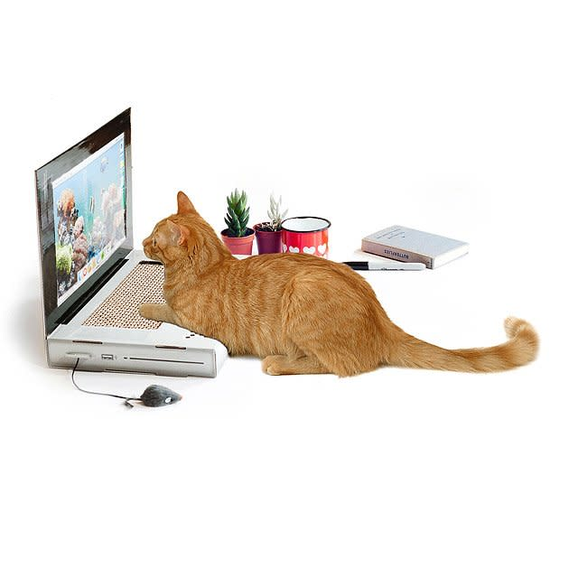

> This post was written in [Neovim](https://neovim.io/).

I'll never forget the fateful day Ze Ming first introduced me to Vim. I recall the mustiness in the air after a tough session of spraying beta at [Lighthouse](https://www.lighthouseclimbing.com/). I recall asking him some inane question about Advent of Code 2022, and my dogwater implementation in Python. Most vividly though, I recall the shock I felt as he opened up his terminal, and proceeded to navigate past file directories, enter his desired file, reach the target line, and make an edit, before I could even open my mouth to voice another braindead observation.

That was my first exposure to **Neovim**.

In hindsight, there were many other impressive things about Ze Ming's setup that day that were completely wasted on me. The fact that his hands never left the keyboard. His rapid and precise navigation of the terminal. The speed with which he employed the perfect tool to tackle any given problem. All this, done within the command line. 

Before that day, I had been a Visual Studio Code simping code monkey, who had no clue about the speed of keyboard-based IDEs. Whenever I saw a video about Emacs or Vim pop up on my youtube, I immediately associated it with the *old guard* of the programming world, a generation destined to become irrelevant by the sheer number of plugins, themes and *"speed"* of VSCode.

That evening, I went home and installed Neovim on my Windows laptop. I remember thinking it would be a short, 20 minute-affair, and that I would be able to return to writing code that same night.

Since that day, I have fallen down multiple rabbit holes of fine-tuning my Neovim configuration, learning `Lua` lang, the terminal, git and other CLI tools, `Bash` scripting, Emacs, file system structure, Linux and ricing, requirements for creating CLI tooling, and a whole lot of other nonsense I cannot immediately recall. While I can't say that I always felt motivated, or confident that I wasn't wasting my time, I can now look back and say with certainty that it has been fulfilling, and fun as heck.

If I had to give myself from a year ago one piece of advice, it would be to **enjoy the learning journey, and embrace the rabbitholes**. In all honesty, I've learnt substantially more forcing myself to chase the curiosity I had for different areas of programming than I have following youtube tutorials and reading documentation for Univeristy curriculum.

While I'm not sure where I'll be in the next 10 years, I hope I can look back and be thankful to those who've helped me in my journey *(thank you Bethel && Zeming)*, and can be proud of the progress I've made overall.

I think that's all I want to say here. Thanks for reading! Happy coding out there.

> *To 2021 Gong:*
> 
> Whether you move fast or slow, whether you break things or not, **be proud of yourself, before its too late**. Make the things you wanna make, experiment with the things that get you excited, because ultimately, you only get as much out of this journey as you put in. You got this brother.
