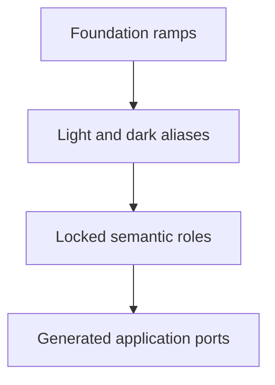

Nib started because I kept changing my terminal theme and never quite liked what happened after hour four.

Some colour schemes looked excellent in screenshots and became tiring once I had to read prose in them. Others were perfectly legible, but felt anonymous. I wanted something closer to the marks I actually enjoy making: a blue-black fountain pen on cool paper, with moss, sepia, graphite and the occasional pool of saturated ink.

This sounds like the sort of problem one can solve by picking twelve hex codes on a Sunday afternoon. It was not.

Nib became a colour system for sustained reading, writing and code. Deep blue-black gives structure to a cool-neutral paper in light mode. Dark mode uses a separate near-black, faintly green charcoal leaf with soft ivory marks; it is not simply the light palette inverted. Selections and diffs behave like diluted washes, while focus and diagnostics use denser, pooled accents.

The repository also contains an interactive showcase, generated contrast and colour-vision reports, installation instructions and the port sources.

## Why fountain-pen ink?

Printing ink was the wrong mental model for what I wanted. A printed shape is usually flat and mechanically consistent. Fountain-pen ink changes with nib width, feed, pressure, paper, drying time and the amount of ink that gathers at the edge of a stroke. The same bottle can produce a fine grey-blue line, a dense blue-black downstroke and a halo of sheen.

That variation gave me a more useful vocabulary for interfaces:

| Writing material | Interface role |
| --- | --- |
| Cool paper | Primary light background |
| Chalkboard charcoal | Primary dark background |
| Blue-black line | Foreground and structural syntax |
| Diluted wash | Selection, diff and secondary surfaces |
| Pooled ink | Focus, diagnostics and active state |
| Moss and teal ink | Types, strings and literal content |
| Sepia and graphite | Properties, punctuation and quiet structure |

The source references include inks from Pilot Iroshizuku, LAMY, Sailor Manyo, Diamine and Pelikan Edelstein. I did not sample their product photographs or claim to reproduce any bottle exactly. A photograph of ink is contingent on the pen, paper, lighting, camera and display, so the references are qualitative: their hierarchy, restraint, temperature and the way colour behaves at different densities.

## Finding the page

The first version leaned too literally into aged stationery. Its light background was yellow enough to feel like a Gruvbox relative, while its dark background drifted into the blue-purple territory already occupied by several popular themes. I liked both in isolation. I liked them much less after several hours.

Instead of continuing to nudge the colours while knowing which version I was looking at, I built a blind preference audit. Nib was compared against twelve established themes with the same TypeScript sample and normalized syntax roles. Opponent order and A/B placement were randomized, identities stayed hidden until export, and I chose light and dark modes independently.

| Result | Light | Dark |
| --- | ---: | ---: |
| Nib preferred | 9 / 12 | 6 / 12 |
| Opponent preferred | 3 / 12 | 6 / 12 |

Mélange was the only opponent I preferred in both modes. Nib won both comparisons against Modus, Rosé Pine, Solarized and Catppuccin. The interesting part was not the score, though. The repeated choices exposed a fairly coherent set of preferences:

- restrained light-mode syntax worked better than high-chroma highlighting;
- cool paper could stay bright without feeling sterile;
- dark surfaces worked best when they were neutral or faintly warm-green, rather than navy;
- bright reds and purple-blue dark backgrounds became tiring fastest;
- a theme could have character without making every token compete for attention.

The audit is personal evidence, not a population study and not proof that Nib is objectively better than another theme. It did, however, stop me from designing around the memory of what I thought I liked. The repository's full audit records the method and every matchup.

## One palette, four layers

The earliest palette mixed reusable colours, light/dark decisions, semantic roles and application-specific names in one place. That worked until every new port needed a colour which did not quite exist. Adding it directly to the port would have been easy, and would also have left me with dozens of tiny palettes that only happened to share a name.

Nib now has four explicit layers:

The foundation provides reusable colour families. Aliases choose which step belongs to each mode. Semantic roles describe intent: foreground, border, diagnostic, selection, diff or syntax. Ports translate those roles into whatever vocabulary an application exposes.

The approved semantic file is pinned by SHA-256. Verification resolves every alias and requires it to match the locked role. A generated port can rearrange the vocabulary, but it cannot casually invent a new red or make the background a little darker. Changing the colours is a deliberate palette revision; adding an application is a mapping exercise.

This distinction is unglamorous and probably the most important piece of the project.

## Base colours

Light and dark modes share a family resemblance, not identical arithmetic. The values below are the core surfaces and marks people spend the most time looking at.

| Role | Light | Dark |
| --- | --- | --- |
| Background | &#9632; `#F2F1EC` | &#9632; `#181A19` |
| Foreground | &#9632; `#182A38` | &#9632; `#DDDCD2` |
| Elevated surface | &#9632; `#E7E8E4` | &#9632; `#20231F` |
| Floating surface | &#9632; `#FAFAF7` | &#9632; `#272A25` |
| Muted text | &#9632; `#59656A` | &#9632; `#969C97` |
| Focus | &#9632; `#315D78` | &#9632; `#82A6B6` |

Normal text and backgrounds avoid pure black and pure white. The light page carries a faint blue-grey cast. The dark page is a chalkboard charcoal rather than blue-black; blue-black moves into the foreground and syntax where it can provide structure without tinting the entire screen.

## Accent colours

The accent order is intentional. Blue-black establishes hierarchy. Moss and teal carry most of the non-blue syntax. Burgundy and rust identify control, exceptions and warm state. Violet is reserved for special constructs. Amber, sepia and graphite support numbers, properties, operators and punctuation.

| Family | Light anchor | Dark anchor | Typical use |
| --- | --- | --- | --- |
| Blue-black | &#9632; `#285D7C` | &#9632; `#83A8BB` | Functions, links, structural ink |
| Moss | &#9632; `#536126` | &#9632; `#A3AE72` | Types and structural concepts |
| Teal | &#9632; `#17666A` | &#9632; `#6FA8A0` | Strings and literal content |
| Burgundy | &#9632; `#7C3448` | &#9632; `#C17E8B` | Control, errors and exceptions |
| Rust | &#9632; `#8A432C` | &#9632; `#C28168` | Warnings and changed state |
| Violet | &#9632; `#684873` | &#9632; `#AF97B7` | Attributes, macros and special forms |
| Amber | &#9632; `#77560F` | &#9632; `#C5A667` | Numbers, search and attention |
| Sepia | &#9632; `#705039` | &#9632; `#AE967B` | Properties and writing-material warmth |
| Graphite | &#9632; `#4F5960` | &#9632; `#959C98` | Operators, punctuation and secondary structure |

Each mode tunes lightness and chroma independently. Dark mode is not allowed to become a neon version of light mode merely because the display has more room for luminous accents.

## Extended palette

Ten families provide thirteen reusable steps from `50` through `950`. The `600` accent values are the approved light-mode anchors and `400` values are the dark-mode anchors. Intermediate steps were constructed in OKLab, clipped to sRGB and reviewed in the showcase. That is a method for extending the palette, not a retroactive story that the original colours fell out of a perfect equation.

| Family | 50 | 100 | 150 | 200 | 300 | 400 | 500 | 600 | 700 | 800 | 850 | 900 | 950 |
| --- | --- | --- | --- | --- | --- | --- | --- | --- | --- | --- | --- | --- | --- |
| Neutral | `#FAFAF7` | `#F2F1EC` | `#E7E8E4` | `#DDDCD2` | `#BABCB4` | `#969C97` | `#767970` | `#707772` | `#59656A` | `#394B56` | `#272A25` | `#20231F` | `#181A19` |
| Blue-black | `#EEF3F5` | `#DBE6EB` | `#C9D9E1` | `#B6CCD7` | `#9BB9C8` | `#83A8BB` | `#56829B` | `#285D7C` | `#1B4963` | `#173B59` | `#102D43` | `#182A38` | `#001421` |
| Moss | `#F1F3EB` | `#E3E7D6` | `#D6DBC2` | `#C8CFAD` | `#B4BE8E` | `#A3AE72` | `#7A874C` | `#536126` | `#404C19` | `#2E370C` | `#242D06` | `#192001` | `#0F1400` |
| Teal | `#EDF3F2` | `#D7E6E4` | `#C2D9D5` | `#ACCCC7` | `#8CB9B2` | `#6FA8A0` | `#468685` | `#17666A` | `#085053` | `#003B3E` | `#003032` | `#002325` | `#001618` |
| Burgundy | `#F8EFF0` | `#F0DBDE` | `#E7C8CD` | `#DDB4BB` | `#CF97A1` | `#C17E8B` | `#9E5969` | `#7C3448` | `#642738` | `#4D1A29` | `#401321` | `#320B17` | `#24050E` |
| Rust | `#F9F0EC` | `#F0DCD5` | `#E7C9BE` | `#DEB6A7` | `#CF9A85` | `#C28168` | `#A6624A` | `#8A432C` | `#6E321E` | `#542211` | `#45190A` | `#350F04` | `#250600` |
| Violet | `#F4F0F5` | `#E8E1EA` | `#DCD1DF` | `#D0C2D5` | `#BEABC5` | `#AF97B7` | `#8B6F94` | `#684873` | `#52375C` | `#3D2745` | `#321E39` | `#25142B` | `#190B1E` |
| Amber | `#F5F1EA` | `#EDE4D4` | `#E5D7BD` | `#DCCAA7` | `#D0B786` | `#C5A667` | `#9D7D3E` | `#77560F` | `#5E4202` | `#462F00` | `#392500` | `#2B1900` | `#1D0E00` |
| Sepia | `#F4F1EE` | `#E8E1D9` | `#DCD1C5` | `#D0C1B2` | `#BEAA94` | `#AE967B` | `#8F7259` | `#705039` | `#593E2A` | `#422C1C` | `#372314` | `#29180B` | `#1C0E05` |
| Graphite | `#F1F2F1` | `#E1E3E2` | `#D1D4D2` | `#C1C5C2` | `#A9AFAC` | `#959C98` | `#717A7C` | `#4F5960` | `#3D454B` | `#2C3338` | `#22292D` | `#181D21` | `#0E1215` |

Specialized selection, diff, border and state colours remain explicit approved values. Forcing them onto a ramp would make the architecture look tidier while potentially making the interface worse, which is a trade I am not interested in.

## Semantic mappings

Syntax highlighting is intentionally a hierarchy rather than a bag of favourite colours. The exact mapping varies with the host application's model, but the common shape is:

| Content | Family |
| --- | --- |
| Ordinary text and variables | Principal blue-black / ivory ink |
| Comments and disabled content | Neutral / graphite |
| Functions and links | Blue-black |
| Types, classes and structural concepts | Moss |
| Strings and literal content | Teal |
| Keywords, control and exceptions | Burgundy |
| Warnings and changed state | Rust |
| Attributes, macros and special constructs | Violet |
| Numbers, constants and search | Amber |
| Properties and fields | Sepia |
| Operators and punctuation | Graphite |

UI states use a separate mapping. A selection is a surface, not bright text. A diff has both a quiet full-line wash and a stronger inline span. Focus is visible without surrounding every component in saturated blue. Diagnostics use colour, but are never expected to communicate severity by hue alone.

## Accessibility is part of the palette

I wanted comfort to be more concrete than saying the colours looked soft. Nib therefore checks the relationships that its ports actually depend on:

- principal text targets at least `7:1` against the background;
- ordinary meaningful prose, code, comments, diagnostics, links, selected text, diff text and ANSI slots 1–15 require at least `4.5:1` against their intended surface;
- boundaries and focus indicators require at least `3:1` against the primary background.

The current principal text ratios are `13.01:1` in light mode and `12.70:1` in dark mode. Comments measure `5.31:1` and `6.25:1`. The narrowest tested boundary ratios are `3.51:1` and `3.14:1`.

Colour-vision simulations for protanopia, deuteranopia and tritanopia are used as regression signals. They are not medical models, and colour distance is not a guarantee of perception. Red and green states can still converge, so diagnostics pair colour with `E`, `W`, `I` and `H` signs and undercurls; deprecated text uses a strikethrough; diffs use `+`, `~` and `-` markers as well as distinct surfaces.

These checks cover the opaque core themes. Transparency, terminal shaders, plugins, font rendering and displays can change the final result. The accessibility report describes the scope and exceptions instead of turning the numbers into a blanket certification.

## Ports, and what “supported” means

Theme repositories have a wonderfully tempting failure mode: generate many files, list many logos and call all of it support. Nib separates availability from evidence.

| Tier | Meaning |
| --- | --- |
| Verified | Manually tested in the target application with a checked-in screenshot |
| Generated | The artifact passes applicable format, structural, contrast or available runtime checks |
| Experimental | The port depends on a third-party loader, archived upstream or an unstable contract |

The canonical showcase is currently verified in Chromium. Native ports remain generated or experimental until their visual-acceptance rows have passing in-application screenshots. A headless Neovim load or a Ghostty configuration check is useful evidence, but neither tells me what the final pixels look like on somebody's desktop.

Current coverage includes:

| Area | Ports |
| --- | --- |
| Editors | Emacs, Helix, IntelliJ, Lite XL, Neovim, Obsidian, Sublime Text, Vim, VS Code/Cursor, Zed |
| Terminals | Alacritty, Black Box, Ghostty, iTerm2, Kitty, Konsole, macOS Terminal, Warp, WezTerm, Windows Terminal, Xresources, Zellij |
| Browsers | Firefox, Chromium, Helium |
| Shell and CLI | fish, fzf, tmux, Yazi; Pywal is experimental |
| Messaging | Telegram Desktop; Discord and Slack are experimental |
| Linux desktop | Dunst, i3, Waybar, Zathura |
| Frameworks | CSS custom properties, Tailwind CSS v4 |
| Creative and data | GIMP, Matplotlib, R |

I do not yet claim marketplace distribution, broad community maintenance, cross-version coverage or years of daily use. Those are properties of a mature ecosystem, not things a generator can prove. The machine-readable support registry and visual-acceptance matrix are the more honest view of where each port stands.

## How it is maintained

The repository treats generated output as a build artifact even though it is checked in for people who just want to install a theme. The authored palette, alias map and per-application templates are the source of truth. Generation expands those into distributable files and documentation.

`make verify` checks schema validity, the semantic lock, alias resolution, deterministic regeneration, generated-file drift, contrast, colour-vision distances, port-specific structure and whatever host runtimes are available. Generated files carry warnings because editing one is both easy and pointless: the next regeneration replaces it.

There are limits to this approach. A parser can show that a theme file is valid. It cannot show that a sidebar is too loud, a diagnostic is illegible beneath a plugin, or a terminal renderer handles bold colours strangely. That is why the showcase, checked-in captures and support tiers sit alongside the automated checks rather than beneath them.

## The name

I called it Nib because the smallest physical part of a fountain pen determines the character of every mark downstream. Broad or fine, dry or wet, rigid or flexible: the ink matters, but so does the system applying it.

That turned out to be a fairly accurate description of a colour scheme too. The palette is only the starting point. Every application has its own rendering model, semantic vocabulary and sharp edges. The work is in preserving the same character while respecting those differences.

## What remains

The palette and generation architecture are in place. The next meaningful work is less horizontal and more empirical: use the native ports, capture both modes in their real applications, test multiple operating systems and versions, and collect reports from people who are not me.

That is slower than adding another theme file. It is also the only way for “supported” to accumulate weight.

The source repository is private while this native-application acceptance pass is underway. When it becomes public, the showcase, installation instructions and contribution guide are already set up to be the entry points.

## Changelog

| Date | Change |
| --- | --- |
| 12 September 2026 | Added the foundation ramps, alias layer, support registry, canonical showcase and broader generated port coverage |
| 11 September 2026 | Completed the blind audit, revised both modes and locked the approved semantic palette |
| 10 September 2026 | Began comparative palette testing and the first application mappings |
